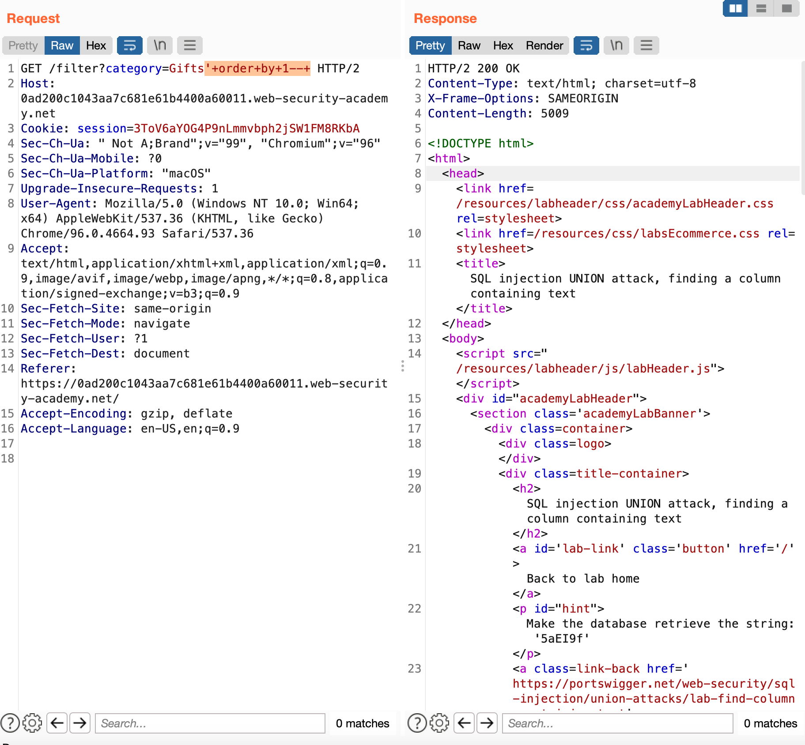
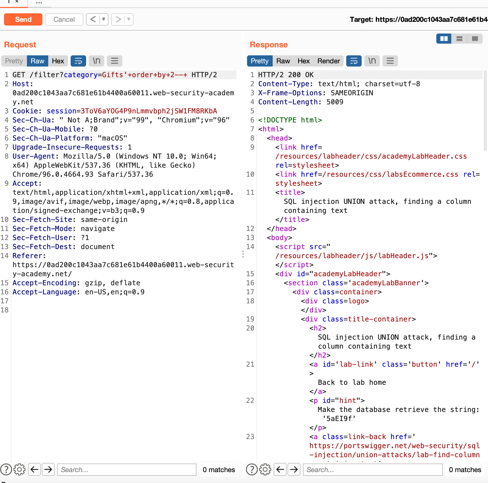
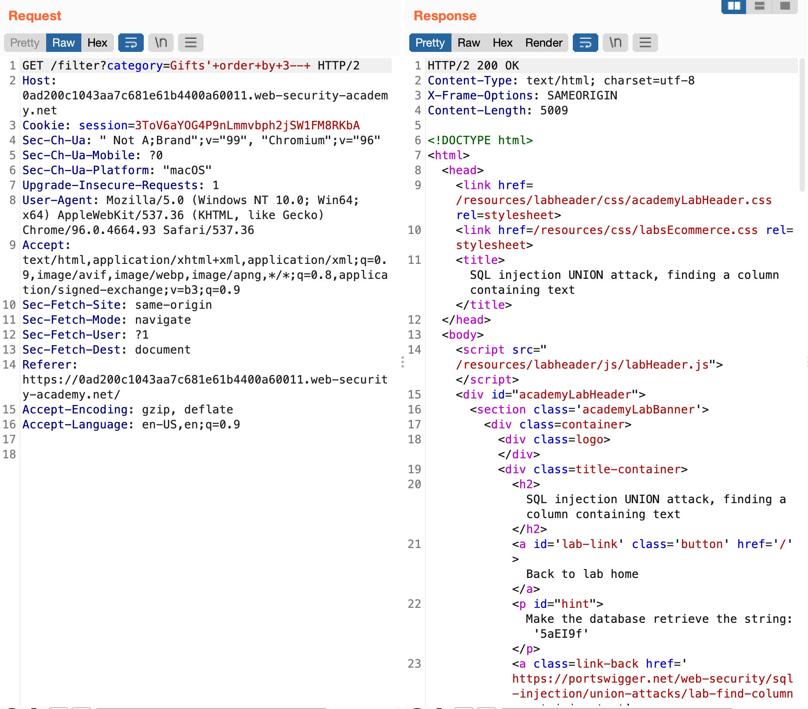
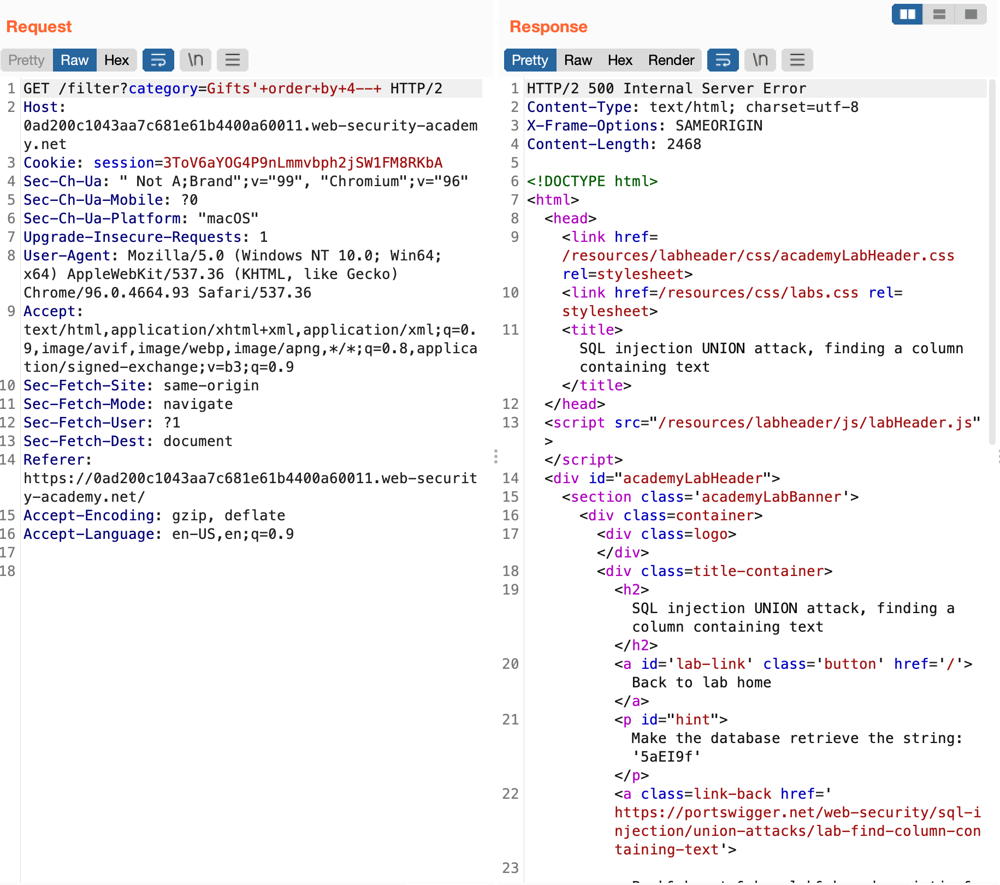
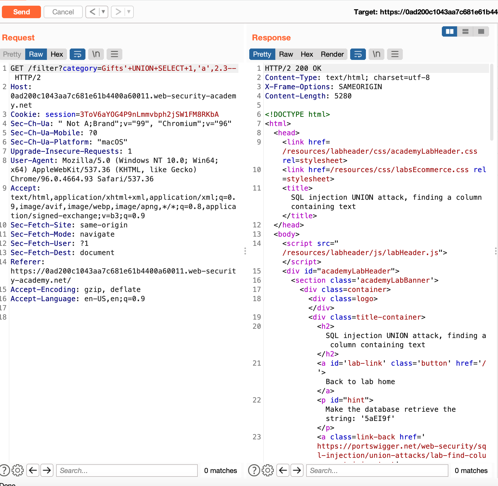
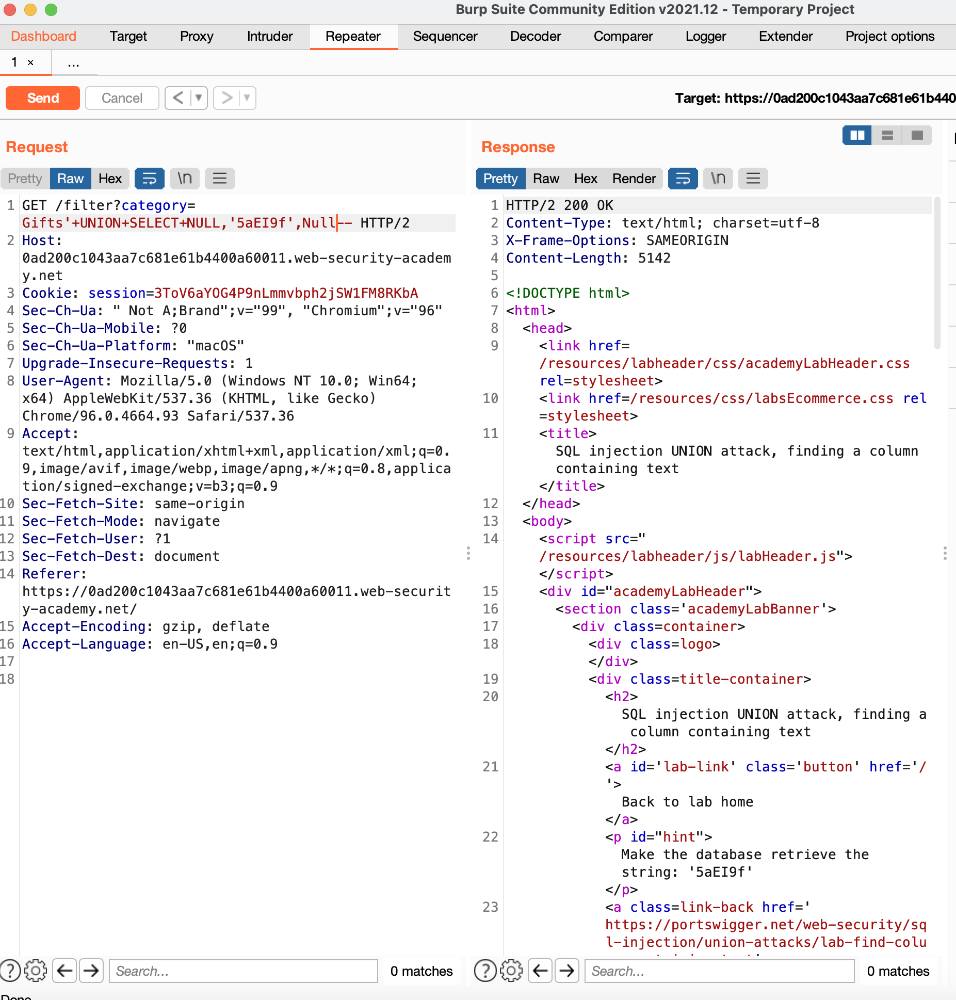
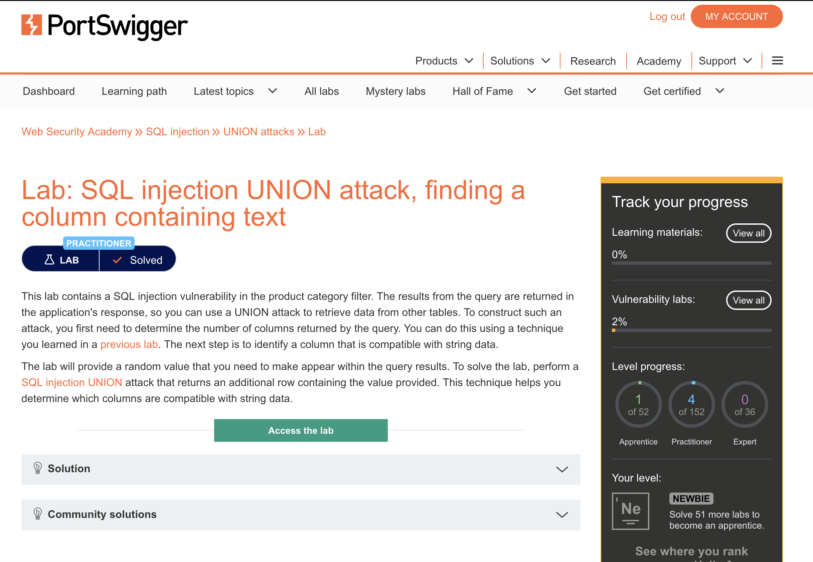

# web-security-academy-sql-injection-union-attack-finding-a-column-containing-text

This repository is solution to assignment on Data Security Course. It is a portswigger [Lab](https://portswigger.net/web-security/sql-injection/union-attacks/lab-find-column-containing-text) which was assigned to me to solve.

# Description

 This lab contains a SQL injection vulnerability in the product category filter. The results from the query are returned in the application's response, so you can use a UNION attack to retrieve data from other tables. To construct such an attack, you first need to determine the number of columns returned by the query. You can do this using a technique you learned in a previous lab. The next step is to identify a column that is compatible with string data.

The lab will provide a random value that you need to make appear within the query results. To solve the lab, perform a SQL injection UNION attack that returns an additional row containing the value provided. This technique helps you determine which columns are compatible with string data. 

# Solution

So we should try to determine the columns of table in gift page by injecting sql command: 

'order by [number]--

These are the result showing that we have 3 columns which one of them is hidden from user on web.

Now we can infer types of columns by performing:

' UNION SELECT 1,'a',2.3--

meaning that the first column is integer, second a string, and third a double.

No we select the text from table with:

' UNION SELECT NULL,'5aEI9f', Null

